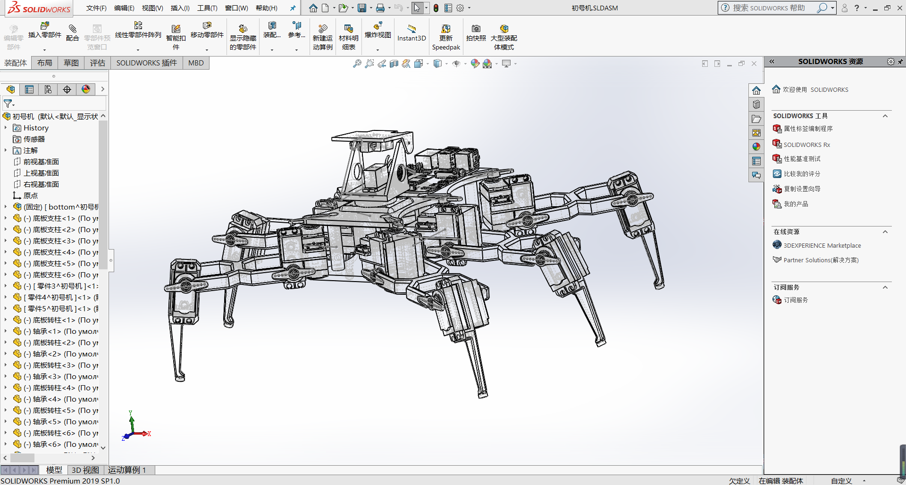
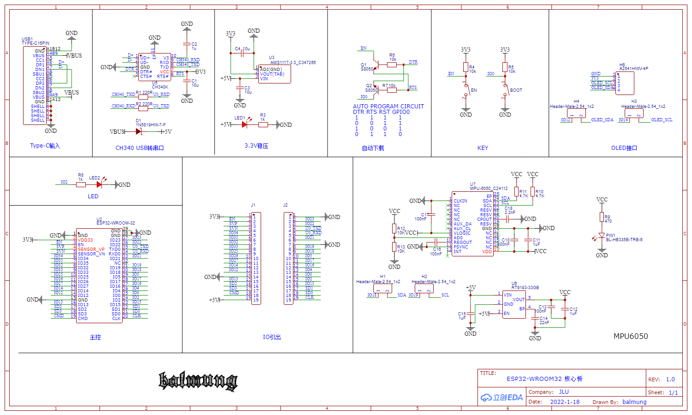
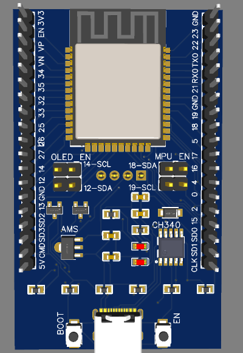
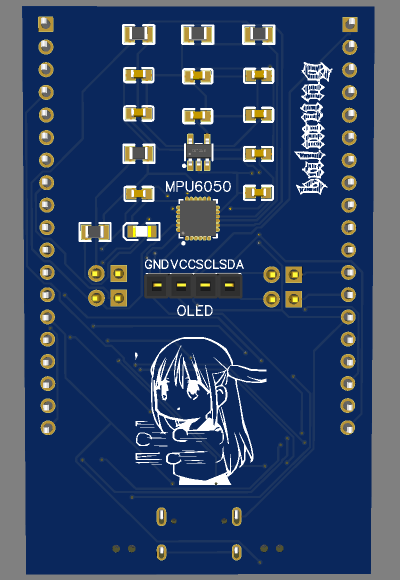
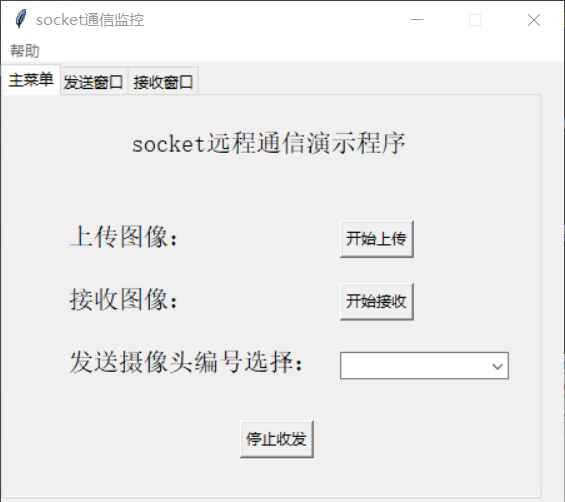

# 基于树莓派的六足机器人方案设计
## 工程内容说明
* 完整工程在 https://github.com/JLU-Automation-Team/spider-robot ，增加了遥控器的micropython代码和运控相关知识概述
### hardware为项目相关硬件设计

 * 机械结构为六足机器人的3d建模工程，包括本体和云台 
 *  遥控器在ESP32最小开发板上集成了MPU6050和OLED接口并设计了使能引脚，可以选择是否收发外设数据
 文件包括PCB的立创EDA文件、Altium文件与3d模型 
### code文件夹内为使用到的各种代码

 * 包括pc控制的上位机和图传程序及其服务器程序、体感遥控器的驱动程序和树莓派部分执行程序
### resource文件夹为项目相关的资料

 * 包括舵机控制板的串口控制指令说明以及运动控制理论及相关资料
### software为使用到的软件内容

 * 舵机控制板的图形化编程上位机以及可能使用到的串口驱动
## 简单预览

 
 
 

## 参考与致谢

>此项目在设计中参考了https://grabcad.com/library/spider-robot-v2-0-mg995-servo-quadruped-on-stm32f103-1
感谢这帮俄国佬；另外，立创EDA永远的神，我认为大家都应该试一试.jpg

>因为马上就要考研了，我们没有时间将设计做成实物，但是在设计过程中仍旧有很大收获
感谢愿意陪着我一起抽风做这玩意的两位队友: [BH3GEI](https://github.com/BH3GEI),[Panzer-Crow](https://github.com/Panzer-Crow)
------------------------
## 最终补充（addition）
> 此项目最终被本人稍作修改当成毕业设计交差了，最后主要进行了如下改动：
* 将遥控器的PCB简化为以ESP32开发板为主，仅外接OLED屏幕及按键
* 服务器端最终采用阿里云服务器，可以通过公网IP进行中转
* 在机器人上增加了JY901B进行姿态感知
* 将图传的方式由TCP改为UDP
* 之前的结构件打印后PLC强度不太够，重新从网上找了一套结构件并重新设计了适配树莓派孔位的顶板结构件
* 丰富了功能（视觉部分和动作组）
* **把论文放进了补充文档中作为参考，可对具体实现原理进行了解**
> 部分代码因为毕业了玩太爽了遗失了，对此说明如下：
* 机器人的UDP图传代码丢失，从老版本的代码修改通信方式TCP为UDP即可
* 机器人的IMU代码丢失，可以从维特智能的JY901B官网进行获取
* 上位机的图传和遥控代码均丢失……图传同上，遥控仅通过标志位进行传输，很好写
* ~~东西丢的实在太多了，有些代码也不是最终版，但是就这样算了，看看文章意思意思得了~~